# AzureMLDeploy

A very simple way to deploy any machine learning model using Azure Functions
---

Source code for an Azure Function App that makes it very simple and easy to deploy any machine learning model (Keras, TensorFlow, PyTorch, XGBoost, LightGBM, scikit-learn, etc) and consume it using any client application via REST APIs.

---

**Have you ever wondered how to deploy a machine learning model as a REST API so that people can use it in apps, websites and general production settings?**

It turns out that this can be complicated: you might need to set up a server with containers, export models and do a lot of other tasks. Well, not anymore. This repository contains code for a simple Azure Function App template that can be used to receive requests from clients, send them to a machine learning server (MLServer) and store the results after they are computed.

The base code for Azure Functions can be found in azure_function_app folder. The simplest way to get started is to create a new function app and create the 4 endpoints needed (2 for client: send task and receive results, 2 for MLServer: retrieve task and send results). Copy and paste each function code and create the Integration with Azure Blob Storage.

# What is in this repository?

- Source code for the Azure Function App that handles client and MLServer data;
- Source code for C# client that sends images for semantic segmentation;
- Source code for python MLServer that uses DeepLabv3+ to predict segmentation masks and sends results to Funcion App server.

# Sample application: Image Segmentation Using DeepLabv3+

As a sample application, we show how to serve the amazing DeepLabv3+ segmentation model (https://github.com/bonlime/keras-deeplab-v3-plus) using a C# client application and a python MLServer (running locally or using Google Colab):

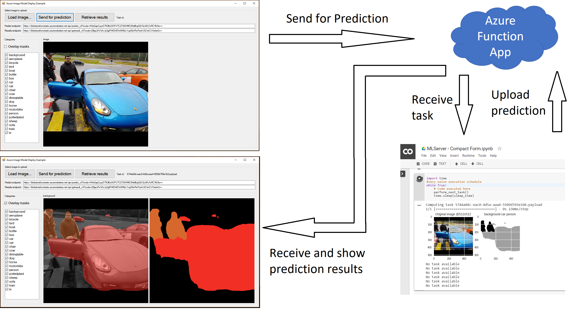

Using this architecture, it is possible to enable serving the segmentation model to a client side application (C# desktop in this case, but it could be anything - HTML, mobile app, desktop - anything that can POST to a REST endpoint). The MLServer keeps listening for new tasks - when one is found, it downloads the tasks, computes predictions and sends results back to the server.

Just change the endpoint addresses to the ones in your Function App.

Note that this setup is invisible to the client application -- it needs only to send query data to the REST API, save the task_id token and use the task_id to retrieve results.

# Creating the Azure Function App

To create and deploy the code to Azure Functions, follow these steps:

## Create the Function App

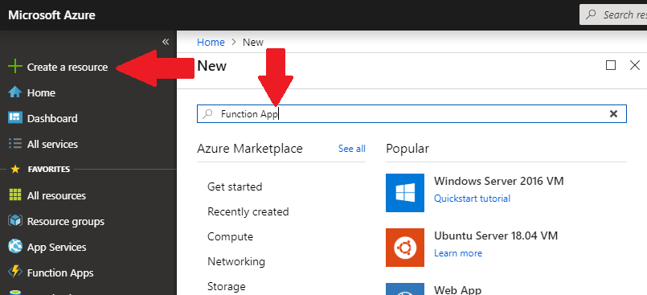

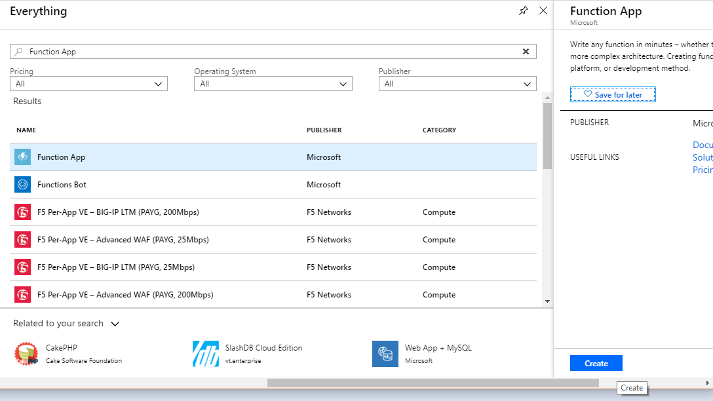

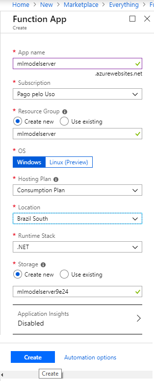

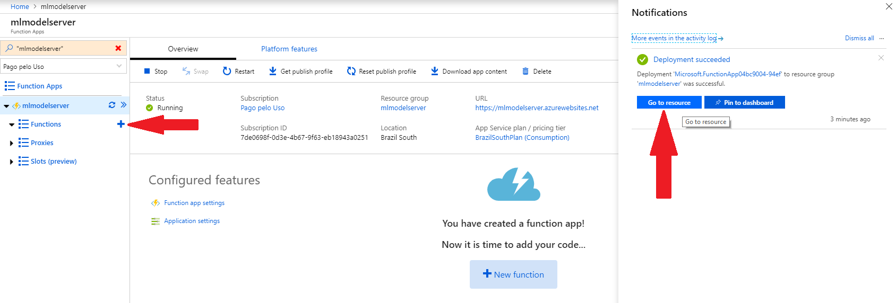

## Create the endpoints

At this point, it is possible to manually install Azure Blob Extension and upload the code using Microsoft Azure Storage Explorer. The simple (although a little longer) way is shown below:

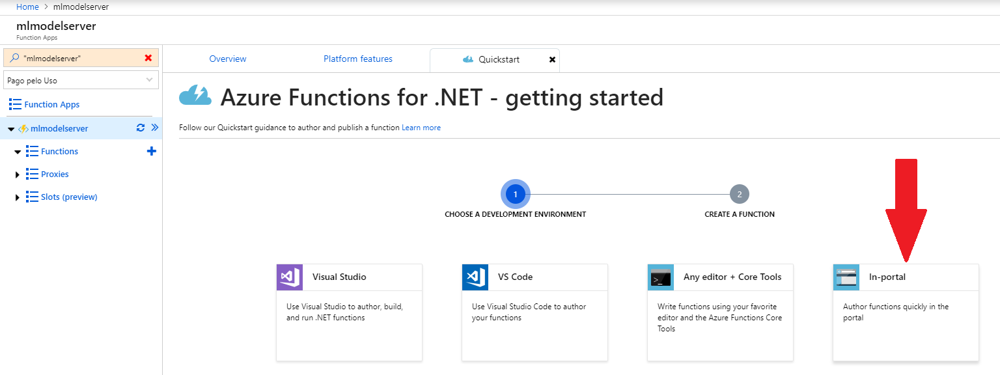

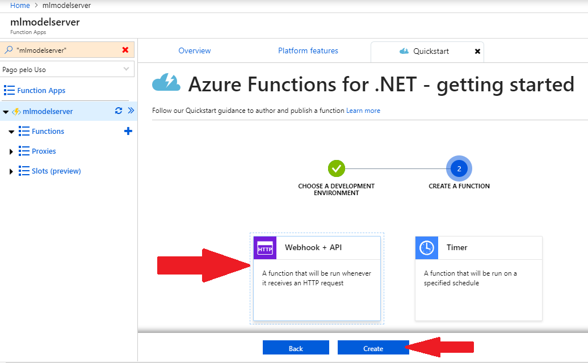

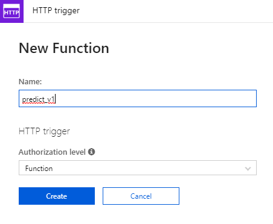

## Add Blob Storage integration

We could simply copy-paste the run.csx and function.json of each function, but we still need to install the Azure Blob Extension and the easiest way to do it is to try to create the blob integration:

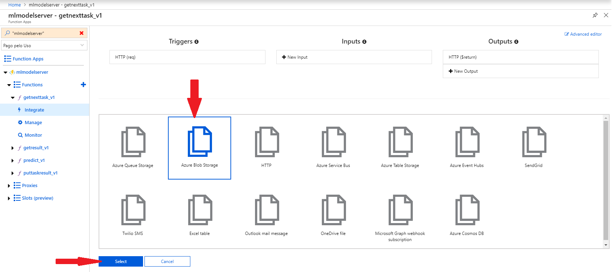

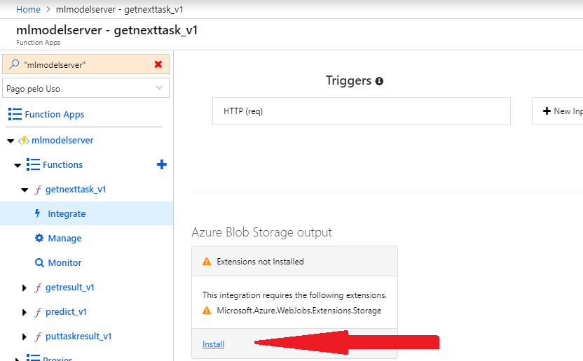

## Copy and paste the code

Now that the Blob extension is ready, all we have to do is copy-paste the run.csx and function.json of each function.

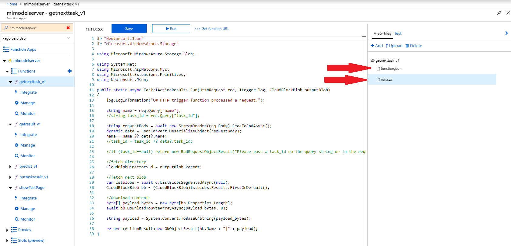

## Test the Function App

We can use a simple Ajax page to check if everything is working properly by creating the showTestPage function that returns an HTML page.

Copy and paste the code for run.csx, create and copy the code to testpage.html (make sure to change the endpoint names to the ones of your own function - they can be accessed at the top of the code using link `</> Get function URL`):

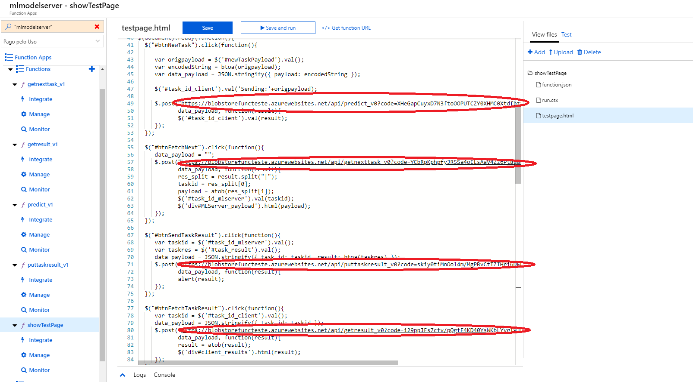

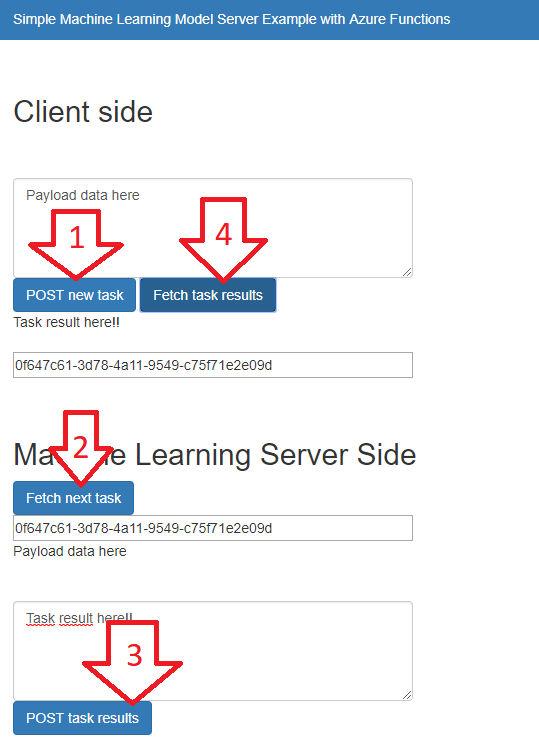

